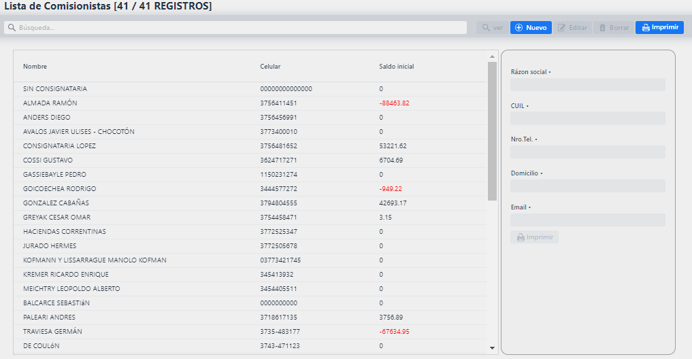

#Pantalla principal

Al iniciar sesion encontrara en la esquina superior izquierda tres lineas horizontales que le permitiran ocultar el **Menu principal** y en la esquina superior derecha botones que le permitiran **cambiar su contraseña** (Candado) o **cerrar su sesion**.

## Menu principal

El menu principal permite la facil **navegacion** entre los sectores, presentadolos en una lista que a su ves cada una contiene una sub-lista para su mejor ordenamiento.

## Interfaz de sectores

Cada sector contiene una lista de sus registros (En este caso 'Consignatarios') la cual se puede filtrar con el campo sobre ella. A su derecha un conjunto de botones y debajo de ellos una previsualizacion.

###### Previsualizacion:
Este es el cuadro de la derecha. Al seleccionar un registro de la lista mostrara datos extra del mismo. A su ves contiene un boton **imprimir** que mostrara los datos del registro seleccionado en un PDF.

###### Botones:

- VER: Previsualizacion completa del registro seleccionado en la lista.
- NUEVO: Crear un nuevo registro.
- EDITAR: Modificar los datos del registro seleccionado.
- BORRAR: Eliminar el registro seleccionado.
- IMPRIMIR: Despliega una lista de reportes en PDF o EXCEL relacionados con el sector (En este caso 'Consignatarios').

## Ventanas de carga o edicion de datos

Las interfaces de carga/edicion de datos cuentan con un formulario con los campos correspondientes a rellenar/cambiar y 3 botones:

- GUARDAR: Guardar los cambios o el nuevo registro.
- GUARDAR Y AGREGAR: Guarda el nuevo registro y mantiene la ventana abierta para otro registro nuevo.
- CANCELAR: Cancelar la operacion.

## Campo especial

En algunos formularios se encontrara con un campo especial (En este caso relacionado a 'Consignatario')

Este tipo de campo le da mas opciones y velocidad a la hora de buscar datos. En el usted puede:
- Si lo sabe de memoria, puede **ingresar el codigo** del registro que desea y ahorrarse la busqueda manual. En este caso es '2' y el codigo que desee debe ingresarse **en el mismo lugar donde este se encuentra**.
- La lupa: Permite desplegar una **lista de los registros** (Consignatarios en este caso), **filtrarlos** con el campo que se encuentra sobre la lista e incluso agregar un registro en el acto con el boton **AGREGAR**.

- La goma: Quitar del control el registro seleccionado, o en otras palabras, limpiar el campo.

- El ojo: Previsualizar el registro seleccionado.

## Grillas

En algunos formularios se encontrara con grillas. Que permite agregar varios regitros a uno solo 'superior' (Por llamarlo de alguna manera).
En el ejemplo de la imagen vemos la grilla de categoria que permite cargar varias categorias al mismo DTE. A su ves vemos que en distintas pestañas tenemos las grillas de 'Numero de DTE', 'Insumos' e 'Impuestos'.

La grilla muestra un **listado de registros** ya cargados y a su ves permite:

Botones:
**LUPA**: Previsualizar un registro cargado.
**MAS**: Agregar un registro.
**LAPIZ Y PAPEL**: Editar un registro.
**TACHO**: Borrar un registro.

## Menu otros

Dentro del menu otros se encuentran los sectores de **Agenda** e **Insumos**.

##### Sector Agenda

Una agenda que le permitira agendar eventos los cuales estan relacionados a comisionista y conductor. Dando click sobre una fecha en la agenda se presentara el formulario.

Ingrese el titulo del evento, seleccione Conductor, seleccione Comisionista, seleccione el color con el que quiere que el evento aparesca en la agenda, ingrese una descripcion y termine la operacion dando al boton **Crear**.

Tambien podra, con los botones que se encuentran sobre la agenda, cambiar el tipo de visualizacion. Cambie el mes/semana que esta viendo con los botones **Previo, Hoy y Siguiente**.

##### Sector insumos

Presenta un listado de insumos con algunos de sus datos. Seleccionando uno de estos se pueden previsualizar mas detalles sobre el mismo en el cuadro de la derecha. A su ves el cuadro de la derecha contiene un boton **imprimir** que mostrara los datos del insumo seleccionado en un PDF.
Puede cargar un nuevo insumo dandole al boton **nuevo**, cargando el formulario que aparecera y terminando la operacion dandole al boton **guardar**, o **guardar y agregar** si desea continuar cargando otro insumo.
Los botones de **ver**, **editar** y **borrar** se habilitan cuando se tiene seleccionado algun registro en la lista.
El boton **imprimir** (Arriba a la derecha) presentara un listado de reportes los cuales usted podra elegir si los desea en un PDF o en EXCEL. Las opciones de reportes en este sector son:
- Listado: Una lista de todos los insumos y algunos de sus datos.

## Menu transporte

Dentro del menu transporte se encuentran los sectores de **Vehiculos** y **Conductor**.

##### Sector vehiculos

El boton **imprimir** (Arriba a la derecha) de este sector contiene los reportes:
- Listado: Una lista de todos los vehiculos y algunos de sus datos.
- Gastos de tipo vehiculo: Seleccione un tipo de vehiculo y un rango de fechas para ver un listado gastos (Insumos, impuestos: ITC, IDC, DGR e IVA)

##### Sector conductores

El boton **imprimir** (Arriba a la derecha) de este sector contiene los reportes:
- Listado: Una lista de todos los conductor y algunos de sus datos.

Dentro del formulario de conductores encontrara la grilla de licencias, que le permitira cargar la cantidad de licencias que desee a dicho conductor o editar/borrar las que ya tenga.

## Menu personas

Dentro del menu personas se encuentran los sectores de **Comisionista**, **Consignatarios** y **Productores**.

##### Sector comisionistas

El boton **imprimir** (Arriba a la derecha) de este sector contiene los reportes:
- Listado: Una lista de todos los comisionistas y algunos de sus datos.
- Rendimiento: Con un comisionista seleccionado en la lista, cargue un rango de fechas y vea el rendimiento de los productores que trabajan con el comisionista seleccionado.
- Saldo: Con un comisionista seleccionado en la lista, cargue un rango de fechas y vea el movimiento del saldo del comisionista seleccionado dentro de las fechas cargadas.

##### Sector consignatarios

El boton **imprimir** (Arriba a la derecha) de este sector contiene los reportes:
- Listado: Una lista de todos los consignatarios y algunos de sus datos.

##### Sector productores

El boton **imprimir** (Arriba a la derecha) de este sector contiene los reportes:
- Listado: Una lista de todos los productores y algunos de sus datos.

Dentro del formulario de productores encontrara la grilla de renspas, que le permitira cargar la cantidad de renspas que desee a dicho productor o editar/borrar las que ya tenga.

## Menu Costos

Dentro del menu personas se encuentran los sectores de **Centro de costos de Graseria**, **Centro de costos de Vehiculos** y **Centro de costos de Cuero**.

Los centros de costos contienen formularios dentro de formularios.

Dentro del formulario inicial de un centro de costo (En este caso: Graseria) encontrara la grilla de insumos.

Al agregar un insumo, en el formulario de agregacion se encontrara con la grilla de impuestos.

## Menu Prefaena

Dentro del menu prefaena se encuentran el sector de **DTE**.

##### DTE

El formulario de DTE es uno extenso y combina muchas funciones.

Luego de cargar el numero de tropa debera cargar el **Origen y Destino**, considere que debera cargar las provincias primero para que el campo localidad se limite a las localidades de la provincia seleccionada.
Encontrara el **campo especial** mencionado con anterioridad repetidas veces en este formulario (Conductor, Comisionista, Consignatario), recuerde que en el puede buscar el dato deseado ingresando su codigo si lo sabe o darle a la lupa para buscarlo desde una lista.
En los campos fechas (Por ejemplo: Fecha de carga) puede darle al icono del calendario para tener un forma grafica de busqueda de la fecha que desee.
En la parte inferior del formulario se encuentran 4 grillas separadas en pestañas (Numero de DTE, Categoria, Insumos e impuestos). Haciendo click sobre el texto puede navegar entre ellas.

###### Grilla: Numero de DTE

(Grilla de numero de DTE y su ventana del formulario de agregacion)

Carga manual de numero de DTE y su correspondiente tropa fiscal.

###### Grilla: Categoria

(Grilla de Categorias y su ventana del formulario de agregacion)

Cargue productor ingresando su codigo o usando la lupa para buscarlo en una lista. Una ves seleccionado el productor el menu desplegable de RENSPA contendra datos de los que podra elegir el deseado. Nuevamente en el campo categoria puede ingresar el codigo o usar la lupa. El resto de campos son cargas manuales.

El boton **Guardar y agregar (F10)** del formulario de categorias guarda lo cargado y mantiene la ventana abierta con los datos cargados anteriormente para agilizar la carga de datos.

###### Grilla: Insumos

(Grilla de Insumos y su ventana del formulario de agregacion)

Cargue insumo ingresando su codigo o usando la lupa para buscarlo en una lista. El resto de campos son cargas manuales.

###### Grilla: Impuestos

(Grilla de Impuestos y su ventana del formulario de agregacion)

Cargue impuesto ingresando su codigo o usando la lupa para buscarlo en una lista. Ingrese el saldo manualmente.

## Menu Faena

Dentro del menu faena se encuentran el sector de **Faena**.

##### FAENA

El campo **Tropa** no permitira cargar una tropa que no sea del productor seleccionado, es por esto que **debe cargar el campo Productor con anterioridad**.
Una ves seleccionada la tropa se le apareceran las categorias de la misma. Donde:
- El campo **Cantidad**: Indica la cantidad de la categoria dentro de la tropa.
- El campo **Faenado**: Indica la cantidad ya faenada.
- El campo **Dif** (Diferencia): Indica la cantidad que queda por faenar.
- El campo **A Faenar**: En este campo debera indicar que cantidad desea faenar y luego darle al boton **CARGAR**.
