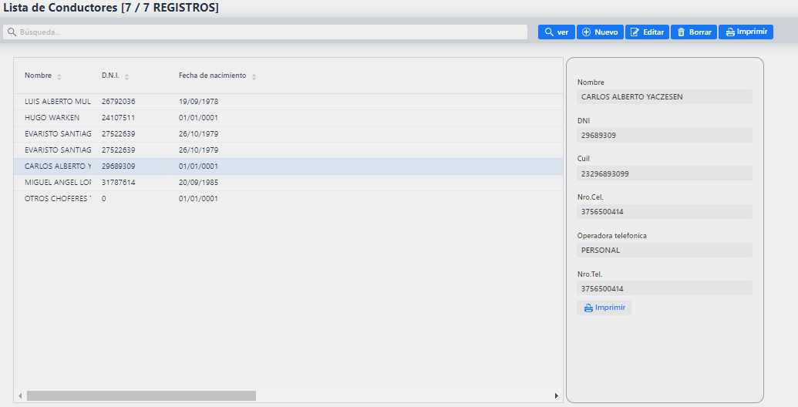

#Pantalla principal

La pantalla inicial que encontrará tan pronto inicie sesión cuenta con un **Menú principal** de navegación desde el cual podrá dirigirse a cualquier sector en cuestión de dos clicks. Este menú de navegación puede ocultarse cuando se deje de usar usando las 3 líneas horizontales ubicadas en la esquina superior izquierda.

En la esquina superior derecha encontrara 2 iconos:
Usando el candado podrá cambiar la contraseña de su cuenta y usando el otro cerrará su sesión.

## Menú principal

El menú principal permite la fácil **navegación** entre los sectores, presentado las opciones en una lista vertical de sectores agrupados. Se agrupan los sectores para mantener el listado en un tamaño accesible y tener un orden. Cada grupo despliega una sub-lista de los sectores, por ejemplo, el grupo 'Personas' contiene los sectores de Comisionistas, Consignatario y Productores.

## Interfaz de sectores

Todas las interfaces o pantallas de los sectores mantienen una misma estructura, de esta forma aprender a usar un sector asegura saber usar el resto.
Tomando de ejemplo el sector de Consignatario explicaremos sus funciones.

Cada sector contiene una lista de sus registros (En este caso Consignatarios) mostrando algunos de sus campos. Sobre el listado un campo de búsqueda le permitirá filtrar la lista para encontrar rápidamente algún registro especifico.

###### Pre visualización:
Este es el cuadro de la derecha. Al seleccionar un registro de la lista mostrara datos extra del mismo. Dentro del mismo contiene un botón **imprimir** que mostrara los datos del registro seleccionado en un PDF.

###### Botones:
Sobre el recuadro de Pre visualización hay un conjunto de botones:

- VER: Pre visualización completa del registro seleccionado en la lista.
- NUEVO: Crear un nuevo registro.
- EDITAR: Modificar los datos del registro seleccionado de la lista.
- BORRAR: Eliminar el registro seleccionado de la lista.
- IMPRIMIR: Despliega una lista de reportes en PDF o EXCEL relacionados con el sector (En este caso 'Consignatarios').

## Ventanas de carga o edición de datos

Cuando utilice los botones de **NUEVO** o **EDITAR** se abrirán ventanas con un formulario. Los campos en este formulario dependerán del registro que este cargando/editando, pero los botones en el mismo siempre tendrán las mismas funciones:

- GUARDAR: Guardar los cambios o el nuevo registro.
- GUARDAR Y AGREGAR: Guarda el nuevo registro y mantiene la ventana abierta para otro registro nuevo.
- CANCELAR: Cancelar la operación.

(Imagen de ejemplo: formulario de Consignatario)

## Campo especial

En algunos formularios se encontrará con un campo especial. Su estructura es la siguiente:
- Una descripción sobre él. En la imagen lo ve como 'Consignatario'.
- Un 'campo de código'. En la imagen lo ve como '2'.
- Un 'campo de descripción' pegado al campo de código. En la imagen lo ve como 'ALMADA RAMON'.
- Pegado al campo de descripción, 3 botones: Lupa, goma y ojo.

Este tipo de campo permite encontrar con mayor rapidez un registro con el cual trabaja repetidamente, buscar con facilidad en un gran conjunto de datos el que usted desea o incluso agregar un registro de otro sector sin necesidad de navegar hasta él.
- Si lo sabe de memoria, puede **ingresar el código** (En el campo de código) del registro que desea y ahorrarse la búsqueda manual.
- La lupa: Permite desplegar una **lista de los registros** (Consignatarios en este caso), **filtrarlos** con el campo que se encuentra sobre la lista e incluso agregar un registro en el acto con el botón **AGREGAR**.

(Imagen de ejemplo: Listado de consignatarios que despliega el botón de la lupa)

- La goma: Quitar del campo el registro seleccionado, o en otras palabras, limpiar el campo.

- El ojo: Pre visualizar el registro seleccionado y todos sus datos.

## Grillas

En algunos formularios se encontrará con grillas (Estructura de filas y columnas). Estas herramientas permitirán agregar varios registros a uno solo 'superior' (Por llamarlo de alguna manera).
- Ejemplo 1: En la imagen de abajo vemos la grilla de categoría que permite cargar varias categorías al mismo DTE. A su vez vemos que en distintas pestañas tenemos las grillas de 'Numero de DTE', 'Insumos' e 'Impuestos'.
- Ejemplo 2: Grilla de licencias para los conductores.
- Ejemplo 3: Grilla de Renspas para los productores.

La grilla muestra un **listado de registros** ya cargados y a su vez permite:

Botones:
**LUPA**: Pre visualizar un registro cargado.
**MAS**: Agregar un registro.
**LAPIZ Y PAPEL**: Editar un registro.
**TACHO**: Borrar un registro.

## Menú otros

Dentro del menú otros se encuentran los sectores de **Agenda** e **Insumos**.

##### Sector Agenda

Una agenda que le permitirá agendar eventos los cuales están relacionados a comisionista y conductor. Dando click sobre una fecha en la agenda se presentará el formulario para realizar un registro.

Ingrese el título del evento, seleccione Conductor, seleccione Comisionista, seleccione el color con el que quiere que el evento aparezca en la agenda, ingrese una descripción y termine la operación dando al botón **Crear**.

También podrá, con los botones que se encuentran sobre la agenda, cambiar el tipo de visualización. Esta son las opciones:

SEMANAL:

AGENDA SEMANAL:

LISTA SEMANAL:

DIARIO:

AGENDA DIARIA:

LISTA DIA:

MENSUAL:

LISTA MENSUAL:

LISTA ANUAL:

Cambie el mes/semana que esta viendo con los botones **Previo, Hoy y Siguiente**.

##### Sector insumos

Tomemos el sector de insumos para reforzar la explicación de sobre la estructura y funcionamiento de los sectores.

Principalmente vemos un listado de insumos con algunos de sus datos.
Seleccionando un registro en la lista se puede pre visualizar más detalles sobre el mismo en el cuadro de la derecha. A su vez el cuadro de la derecha contiene un botón **imprimir** que mostrara los datos del insumo seleccionado en un PDF.
Puede cargar un nuevo insumo dándole al botón **nuevo**, cargando el formulario que aparecerá y terminando la operación dándole al botón **guardar**, o **guardar y agregar** si desea continuar cargando otro insumo.
Los botones de **ver**, **editar** y **borrar** se habilitan cuando se tiene seleccionado algún registro en la lista.
El botón **imprimir** (Arriba a la derecha) presentará un listado de reportes los cuales usted podrá elegir si los desea en un PDF o en EXCEL. Las opciones de reportes en este sector son:
- Listado: Una lista de todos los insumos y algunos de sus datos.

## Menú transporte

Dentro del menú transporte se encuentran los sectores de **Vehículos** y **Conductores**.

##### Sector vehículos

El botón **imprimir** (Arriba a la derecha) de este sector contiene los reportes:
- Listado: Una lista de todos los vehículos y algunos de sus datos.
- Gastos de tipo vehículo: Seleccione un tipo de vehículo y un rango de fechas para ver un listado gastos (Insumos, impuestos: ITC, IDC, DGR e IVA)

##### Sector conductores

El botón **imprimir** (Arriba a la derecha) de este sector contiene los reportes:
- Listado: Una lista de todos los conductores y algunos de sus datos.

Dentro del formulario de conductores encontrara la grilla de licencias, que le permitirá cargar la cantidad de licencias que desee a dicho conductor o editar/borrar las que ya tenga.

## Menú personas

Dentro del menú personas se encuentran los sectores de **Comisionista**, **Consignatarios** y **Productores**.

##### Sector comisionistas

En el listado de los comisionistas los saldos iniciales que se encuentren en negativo aparecerán coloreados en rojo.

El botón **imprimir** (Arriba a la derecha) de este sector contiene los reportes:
- Listado: Una lista de todos los comisionistas y algunos de sus datos.
- Rendimiento: Con un comisionista seleccionado en la lista, cargue un rango de fechas y vea el rendimiento de los productores que trabajan con el comisionista seleccionado.
- Saldo: Con un comisionista seleccionado en la lista, cargue un rango de fechas y vea el movimiento del saldo del comisionista seleccionado dentro de las fechas cargadas.

##### Sector consignatarios

El botón **imprimir** (Arriba a la derecha) de este sector contiene los reportes:
- Listado: Una lista de todos los consignatarios y algunos de sus datos.

##### Sector productores

El botón **imprimir** (Arriba a la derecha) de este sector contiene los reportes:
- Listado: Una lista de todos los productores y algunos de sus datos.

Dentro del formulario de productores encontrara la grilla de renspas, que le permitirá cargar la cantidad de renspas que desee a dicho productor o editar/borrar las que ya tenga.

## Menú Costos

Dentro del menú personas se encuentran los sectores de **Centro de costos de Graseria**, **Centro de costos de Vehículos** y **Centro de costos de Cuero**.

Los centros de costos contienen formularios dentro de formularios.

Dentro del formulario inicial de un centro de costo (En este caso: Grasería) encontrara la grilla de insumos.

Al agregar un insumo, en el formulario de agregación se encontrará con la grilla de impuestos.

##### Reportes en grasería:

El botón **imprimir** (Arriba a la derecha) del centro de costo de grasería contiene los reportes:
- Listado: Ingrese un rango de fechas y vea una lista de todos los costos registrados, sus totales y un total general.

## Menú Pre faena

Dentro del menú pre faena se encuentran el sector de **DTE**.

##### DTE

El formulario de DTE es uno extenso y combina muchas funciones.

Luego de cargar el número de tropa deberá cargar el **Origen y Destino**, considere que deberá cargar las provincias primero para que el campo localidad se limite a las localidades de la provincia seleccionada.
Encontrará el **campo especial** mencionado con anterioridad repetidas veces en este formulario (Conductor, Comisionista, Consignatario), recuerde que en él puede buscar el dato deseado ingresando su código si lo sabe o darle a la lupa para buscarlo desde una lista.
En los campos fechas (Por ejemplo: Fecha de carga) puede darle al icono del calendario para tener una forma gráfica de búsqueda de la fecha que desee.

El botón **imprimir** (Arriba a la derecha) de este sector contiene los reportes:
- Listado: Una lista de todos los DTEs y algunos de sus datos.
- Saldo de la tropa: Con un DTE seleccionado en la lista, vea el saldo final de esta tropa.
- Precio por categoría: Seleccione un rango de fechas, una categoría animal y vea los totales de Kg vivo, Kg carne, importe bruto y valor de comisión.

En la parte inferior del formulario se encuentran 4 grillas separadas en pestañas (Numero de DTE, Categoría, Insumos e impuestos). Haciendo click sobre el texto puede navegar entre ellas.

###### Grilla: Numero de DTE

(Grilla de numero de DTE y su ventana del formulario de agregación)

Carga manual de numero de DTE y su correspondiente tropa fiscal.

###### Grilla: Categorías

(Grilla de Categorías y su ventana del formulario de agregación)

Cargue productor ingresando su código o usando la lupa para buscarlo en una lista. Una vez seleccionado el productor el menú desplegable de RENSPA contendrá datos de los que podrá elegir el deseado. Nuevamente en el campo categoría puede ingresar el código o usar la lupa. El resto de campos son cargas manuales.

El botón **Guardar y agregar (F10)** del formulario de categorías guarda lo cargado y mantiene la ventana abierta con los datos cargados anteriormente para agilizar la carga de datos.

###### Grilla: Insumos

(Grilla de Insumos y su ventana del formulario de agregación)

Cargue insumo ingresando su código o usando la lupa para buscarlo en una lista. El resto de campos son cargas manuales.

###### Grilla: Impuestos

(Grilla de Impuestos y su ventana del formulario de agregación)

Cargue impuesto ingresando su código o usando la lupa para buscarlo en una lista. Ingrese el saldo manualmente.

## Menu Faena

Dentro del menu faena se encuentran el sector de **Faena**.

##### FAENA

El formulario de Faena se desplegará completamente al cabo de terminar los pasos iniciales.

Cargue los campos Fecha y Numero, cuando **cargue el Productor recién tendrá la posibilidad de cargar el campo Tropa**, debido a que las categorías que se presentaran debajo deben estar relacionados a un determinado productor.

Una vez seleccionada la tropa se le aparecerán las categorías de la misma. Donde:
- El campo **Cantidad**: Indica la cantidad de la categoría dentro de la tropa.
- El campo **Faenado**: Indica la cantidad ya faenada.
- El campo **Dif** (Diferencia): Indica la cantidad que queda por faenar.
- El campo **A Faenar**: En este campo deberá indicar que cantidad desea faenar y luego darle al botón CARGAR.

Una vez presionado el botón cargar se rellenará la tabla debajo.
Considere:
- El campo **Categoría** indica la categoría de salida de la faena, ya que esta puede cambiar.
- Si intenta cargar en el campo 'A Faenar' un valor mayor al disponible (Campo diferencia) el sistema limpiara el campo y le informara que esto no es posible.
- Si cambia el valor del campo 'A faenar' los valores de peso cargados se mantendrán.
- Usted podrá presionar CARGAR en distintas cabeceras y no perderá los datos de pesos que haya cargado.
- Si se encuentra cargando los pesos (El cursor debe encontrarse dentro de un campo peso) puede utilizar la tecla de tabulación para pasar al siguiente campo de peso con más rapidez.

El botón **imprimir** (Arriba a la derecha) de este sector contiene los reportes:
- Listado: Con una Faena seleccionada de la lista, vea sus detalles.

## Menú parámetros del sistema

##### PARAMETROS GENERALES

En este sector se encuentran registros mezclados que contienen pocos datos. Unos ejemplos serían las localidades que solo poseen el dato de descripción y la provincia a la que pertenecen; o podrían ser impuestos, categoría animal, color de vehículo, etc. Estos registros solo poseen una descripción como dato y nada más.

##### USUARIOS

Desde aquí usted podrá crear nuevos usuarios y asignarle un rol en el sistema para así definir sus permisos.

